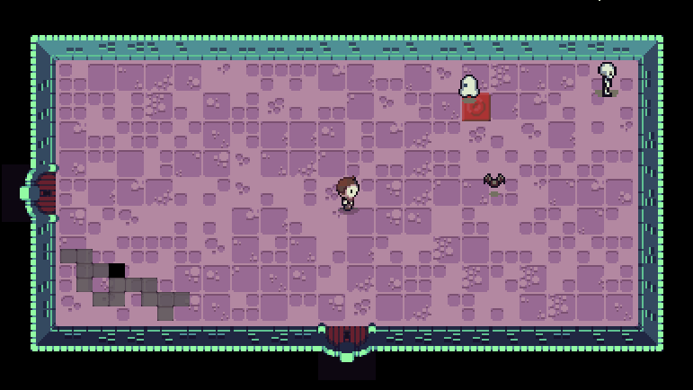

This project is based on [Scavengers2D](https://github.com/KartikChugh/Scavengers2D) by Kartik Chugh, licensed under [CC BY-NC-SA 4.0](https://creativecommons.org/licenses/by-nc-sa/4.0/).

2D Top-down roguelike made with **Unity**, featuring procedural dungeon generation

  

## What is it all about?

The game was originally developed with **Love2D Engine**, using Lua as a programming language and featured **infinity dungeon generation** (simulate infinitely transitioning from one room to another)

The main goal for this project is to actually implement a proper procedural dungeon generation.

## Programming Achievements:

- 2D Top-Down Perspective
- Procedural Dungeon Generation (based on Binding of Isaac's Level Generation)
- Procedural Room Generation
- Custom Kinematic Controller (Improved collisions)
- Finite State Machine pattern to manage Entities (Player and monsters) states
- Screen Scrolling (Room transitioning)
- Enemy AI (custom implementation)

## Goals

As mentioned before, the main goal is to make a proper game based on the original prototype, and continue learning and improving my skills as a programmer and Unity developer. The second one, but not the least, is to achive the first goal, **using the best aproches, technics, tools and design patterns possible**.
